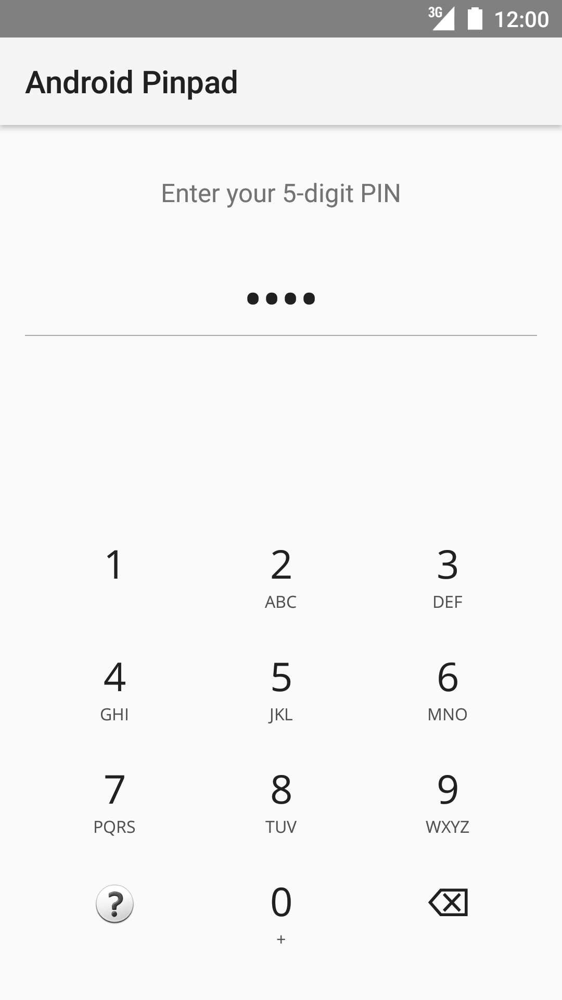

# Android Pinpad
Android Pinpad with flexible configuration and pluggable feedback interface. 

The library is made up of TWO components working together as ONE; the pinpad and it's accompanying view provider.
This distinction is made so as to enhance composability. It is particularly useful if you have a highly cusomtized layout 
and will like your components arranged in a certain way, or if your layout needs to look just as nice 
in a landscape orientation.




## Usage
### Installation
Gradle

```groovy
dependencies {
    compile "com.hextremelabs.pinpad:pinpad:0.1.0"
}
```

Maven

```xml
<dependency>
    <groupId>com.hextremelabs.pinpad</groupId>
    <artifactId>pinpad</artifactId>
    <version>0.1.0</version>
</dependency>
```

### Usage
#### XML
```xml
<com.hextremelabs.pinpad.PinTextView
    android:id="@+id/pinview"
    android:layout_width="match_parent"
    android:layout_height="wrap_content" />
    
<com.hextremelabs.pinpad.PinpadView
    android:id="@+id/pinpad"
    android:layout_width="match_parent"
    android:layout_height="wrap_content" />
````

#### Kotlin
```kotlin
pinpad.viewProvider = pinview
pinpad.callback = object: PinpadView.Callback {
     override fun onPasscodeComplete(passcode: String) {}
     override fun onHelpRequest() {}
 }
```

#### Java
```java
pinpad.setViewProvider(pinview)
pinpad.setCallback(new PinpadView.Callback() {
    @Override public void onPasscodeComplete(String passcode) {}
    @Override public void onHelpRequest() {}
})
```

### Configuration
#### Via XML
```xml
<com.hextremelabs.pinpad.PinpadView
    android:id="@+id/pinpad"
    android:layout_width="match_parent"
    android:layout_height="wrap_content"
    app:fontSource="fonts/OpenSans-Regular-webfont.ttf"
    app:keyBackground="?selectableItemBackgroundBorderless"
    app:keySpacing="8dp"
    app:numDigits="5"
    app:subTextColor="#505050"
    app:subTextSize="12sp"
    app:textColor="#202020"
    app:textSize="28sp" />
```

#### Via Code
```kotlin
pinpad.setTypeface(typeface: Typeface);
pinpad.setKeyBackgroundDrawable(drawable: Drawable);
pinpad.setKeyTextSize(textSize: Float);
pinpad.setKeySubTextSize(subTextSize: Float);
pinpad.setKeyTextColor(textColor: Int);
pinpad.setKeySubTextColor(subTextColor: Int);
pinpad.setSpacing(spacing: Int);
```

### Custom Feedback View
It is possible to implement your own view of the entered passcode. 
Simply code your view and let it implement `PinpadView.ViewProvider`. 
Once this is done, let the pinpad know about it via `PinPad#viewProvider`

#### For example
```kotlin
class PinTextView @JvmOverloads constructor(
  context: Context,
  attrs: AttributeSet? = null,
  defStyleAttr: Int = 0) : AppCompatTextView(context, attrs, defStyleAttr), PinpadView.ViewProvider {

    init {
        inputType = InputType.TYPE_CLASS_TEXT or InputType.TYPE_TEXT_VARIATION_PASSWORD
        gravity = Gravity.CENTER
        textSize = 40F
    }

    override fun setNumDigits(numDigits: Int) {
        //no-op
    }

    @SuppressLint("SetTextI18n")
    override fun onAppendChar(char: Char) {
        text = text.toString() + char
    }

    override fun onDeleteChar() {
        text = text.substring(0, text.lastIndex)
    }

    override fun onReset() {
        text = ""
    }
}

// On setup
pinpad.viewProvider = findViewById(R.id.pinTextView) as ViewProvider
```


## Author
Kingsley Adio,
Hextremelabs Ltd.<br/>
Email: kingsley@hextremelabs.com

## License
```
Copyright 2017 Hextremelabs Ltd.

Licensed under the Apache License, Version 2.0 (the "License");
you may not use this file except in compliance with the License.
You may obtain a copy of the License at

   http://www.apache.org/licenses/LICENSE-2.0

Unless required by applicable law or agreed to in writing, software
distributed under the License is distributed on an "AS IS" BASIS,
WITHOUT WARRANTIES OR CONDITIONS OF ANY KIND, either express or implied.
See the License for the specific language governing permissions and
limitations under the License.
```
